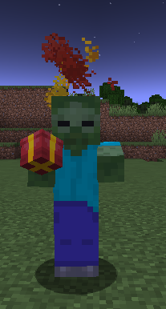
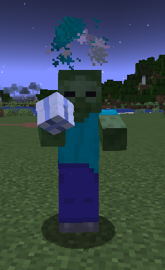

# Frosty 
By Foxikle

## Gifts
You can collect gifts by killing mobs. The color of the particles orbiting their
head indecates the type of gift the mob will drop. There are three kinds of gifts. 
The most common Evergreen gifts range in loot from dirt to diamonds. The second
most common Scarlet gifts range from 9 iron nuggest to a diamond block. The most
rare Frosty gifts range from a pile of emeralds to a block of netherite!

  
Mobs with gifts

  <ol>
    <li>
        
    </li>
    <li>
        
    </li>
    <li>
        
    </li>
  </ol>

## Opening Gifts
Navigate to an open area for best results. Right click while holding a gift 
to begin playing the opening animation. Each gift has its own opening animation!
